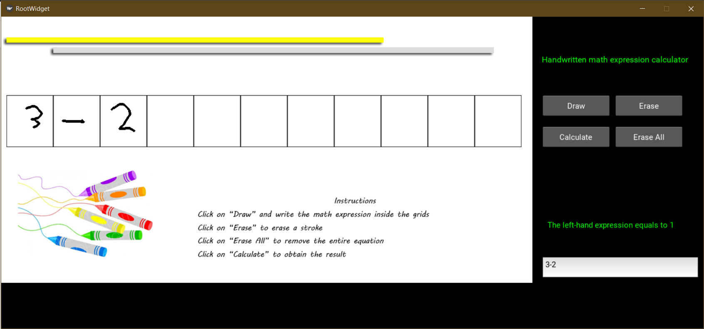

A GUI of handwritten-calculator-with-automated-marking function.

I made this project because I think it will make the life easier for the young kids to practice their calculation skills.

Written with Pytorch and the neural network is Resnet-18, the validation accuracy is 97.7%.

It is ready-to-use (You need to install some libraries of course).

Please refer to the install instructions below.

To run it, run Untitled.ipynb. If that doesn't work or you are not using Jupyter Notebook. Just call python theGUI.py

-------------------------------install instructions-------------------------------------

5 libraries are needed

opencv, pytorch, torchvision, kivy, fs

please install opencv using 'pip install opencv-python'
if this fails (very likely), please use 'pip install --upgrade pip' first.

for torchvision please use the following line as general pip install and conda install will fail.
'pip install torch===1.5.0 torchvision===0.6.0 -f https://download.pytorch.org/whl/torch_stable.html'
this line may change according to time, please refer to https://pytorch.org/

----------------------------to developers------------------------------- 

The dataset I used is now uploaded to https://www.kaggle.com/clarencezhao/handwritten-math-symbol-dataset

UIEvent.py contains all functions running on the GUI includes drawing and calculation etc.

theGUI.py defines the GUI.

model.py defines the neural network and image transformation techniques.

functions.py contains real-time running functions for the GUI, like displaying dotted line to notify the user what is the expected result of the current drawing line.

sliced ones stores sliced images from the GUI.

final3channel is the pre-trained Resnet model.